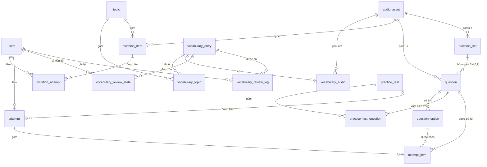

# ADR-001 — Data model cho Learning Hub và TOEIC Practice

**Trạng thái:** Đã chốt · 2026-08-09 · A6.1 và A6.2 đã đóng cùng ngày
**Giải quyết:** `REVIEW-OPUS.md` §7a — thứ **duy nhất** còn chặn Phase 2
**Liên quan:** `PHASE2-AUDIO.md` §A6 (bắt buộc bảng nối 4 accent) · §A4.4 (`source_text` không phải đáp án chấm bài)

Tài liệu này có hai phần với vòng đời khác nhau, giống `PHASE2-AUDIO.md`:

- **Phần A — Quyết định.** Còn giá trị lâu dài. Sáu tháng sau đọc lại vẫn phải trả lời được "vì sao lại làm thế này".
- **Phần B — Schema chi tiết.** Là tài liệu tra cứu; khi code đã chạy thì bản thân model + migration mới là nguồn sự thật, phần này chỉ còn để hiểu ý đồ.

---
---

# PHẦN A — QUYẾT ĐỊNH

## A1. Vấn đề

`PLAN.md` mô tả bốn module nhưng **không có một dòng nào về dữ liệu**. Phase 2 (Vocabulary, Dictation) và Phase 3 (Practice by Part, Full Mock Test) đều không thể bắt đầu nếu chưa biết câu hỏi được lưu thế nào.

`REVIEW-OPUS.md` §7a xếp đây là **rủi ro số 1 của dự án**, với lời cảnh báo cụ thể: *"Nếu code trước, thiết kế sau, sẽ phải refactor toàn bộ ở giữa Phase 3."*

Cảnh báo đó không trừu tượng. Nó có một hình dạng rất cụ thể, và đó là toàn bộ lý do tài liệu này tồn tại — xem A2.

## A2. Kiến thức miền quyết định hình dạng schema

Không đọc kỹ cấu trúc đề TOEIC thì sẽ thiết kế sai. Đây là bảng cần thuộc:

| Part | Tên | Số câu | Số đáp án | Kích thích (stimulus) | Nhóm câu? |
|---|---|---|---|---|---|
| 1 | Photographs | 6 | **4** | Ảnh + audio, **riêng từng câu** | Không |
| 2 | Question–Response | 25 | **3** | Audio, riêng từng câu. **Không in đề, không in đáp án** | Không |
| 3 | Conversations | 39 | 4 | Audio hội thoại, **dùng chung** | **Có** — 13 đoạn × 3 câu |
| 4 | Short Talks | 30 | 4 | Audio độc thoại, **dùng chung** | **Có** — 10 bài × 3 câu |
| 5 | Incomplete Sentences | 30 | 4 | Không | Không |
| 6 | Text Completion | 16 | 4 | Đoạn văn, **dùng chung** | **Có** — 4 đoạn × 4 câu |
| 7 | Reading Comprehension | 54 | 4 | 1–3 đoạn văn, **dùng chung** | **Có** — đơn và đa đoạn |

Tổng 200 câu · Listening 100 (~45 phút) · Reading 100 (75 phút) · thang điểm 10–990.

Ba điều rút ra, cả ba đều đổi schema:

1. **Part 3, 4, 6, 7 nhóm nhiều câu dưới một kích thích dùng chung.** Nếu coi mỗi câu hỏi là một thực thể độc lập thì không có chỗ để đặt đoạn audio của Part 3 — và đó chính là cuộc refactor giữa Phase 3 mà §7a cảnh báo. Đây là lý do có bảng `question_set`.
2. **Part 2 có 3 đáp án, các part khác có 4.** Nên số đáp án **không** cố định ⇒ không thể là bốn cột `option_a..option_d`.
3. **Part 2 không in đề bài lẫn đáp án** — thí sinh chỉ nghe. Nên `prompt_text` phải nullable, và nullable ở đây là *đúng ngữ nghĩa* chứ không phải dữ liệu thiếu.

## A3. Phạm vi

| Vào migration `003` ngay | Chỉ thiết kế trên giấy (Phần C) |
|---|---|
| Vocabulary + topic + audio 4 accent | `study_plan`, `study_plan_item` |
| Spaced repetition (SM-2) | `learning_memory` (pgvector) |
| Dictation + lượt làm bài | `knowledge_chunk` (RAG corpus, pgvector) |
| Question / option / question_set | `ai_interaction`, `ai_usage` (ngân sách token — §7d) |
| Practice test + lượt làm bài + từng câu trả lời | `user_progress` (snapshot cho dashboard) |

Lý do cắt ở đó: bảng Phase 4–5 phụ thuộc vào những quyết định **chưa có** (ADR-003 chưa viết: chọn LLM provider nào, embedding model nào, chiều vector bao nhiêu). Tạo bảng `learning_memory` bây giờ là đoán chiều của `vector(n)` — đoán sai thì phải migrate lại toàn bộ. Thiết kế trên giấy giữ được tính mạch lạc mà không phải cam kết sớm.

## A4. Các quyết định

### A4.1 — Đáp án là bảng riêng, không phải JSONB

| | |
|---|---|
| **Chốt** | `question_option(question_id, label, content, is_correct)` |
| **Thay vì** | Cột JSONB trên `question` · bốn cột `option_a..option_d` |
| **Vì sao** | Bốn cột chết ngay ở Part 2 (3 đáp án). JSONB thì chạy được, nhưng `attempt_item.selected_option_id` sẽ không có gì để trỏ tới — mà **phân tích distractor** ("học viên hay chọn nhầm phương án nào") lại chính là dữ liệu AI Coach cần để chỉ ra điểm yếu. Có FK thật thì câu hỏi đó là một câu `GROUP BY`; với JSONB thì nó là một cuộc migrate |
| **Đánh đổi** | Thêm một join khi render. Không đáng kể — luôn là join theo index trên `question_id` |

**Ràng buộc:** partial unique index `(question_id) WHERE is_correct` đảm bảo **nhiều nhất một** đáp án đúng. Ràng buộc "**ít nhất một**" không diễn đạt được bằng constraint khai báo trên một bảng — nó được kiểm ở tầng seed và có test. Xem B4.

### A4.2 — `question_set` là nullable, không phải bắt buộc

| | |
|---|---|
| **Chốt** | `question.set_id` nullable; CHECK bắt buộc có set với part 3, 4, 6, 7 |
| **Thay vì** | Mọi câu đều thuộc một set (part 1/2/5 là "set một câu") |
| **Vì sao** | Bắt buộc set cho tất cả thì thống nhất được đường render, nhưng đổi lại 61 hàng vô nghĩa mỗi đề đầy đủ, và "set một câu" là một khái niệm không có thật trong miền. CHECK theo part diễn đạt đúng luật thật của TOEIC và bắt được nội dung sai **ngay lúc seed**, không phải lúc học viên mở bài |
| **Đánh đổi** | Client phải xử lý hai hình dạng. Chấp nhận được: hai hình dạng đó có thật, giả vờ chỉ có một không làm chúng biến mất |

### A4.3 — Audio gắn ở hai tầng, đúng như đề thi

| | |
|---|---|
| **Chốt** | `question.audio_asset_id` (Part 1, 2) **và** `question_set.audio_asset_id` (Part 3, 4) |
| **Thay vì** | Chỉ một trong hai |
| **Vì sao** | Part 1 và 2 mỗi câu một file; Part 3 và 4 nhiều câu chung một file. Đây là sự thật của đề thi chứ không phải lựa chọn thiết kế |
| **Đánh đổi** | Người đọc phải biết tra ở đâu. Giảm nhẹ bằng quy tắc một dòng: *part 1–2 tra ở câu, part 3–4 tra ở set* |

### A4.4 — Từ vựng: bảng nối có `kind`, không chỉ có `accent`

| | |
|---|---|
| **Chốt** | `vocabulary_audio(entry_id, kind, accent, audio_asset_id)`, UNIQUE `(entry_id, kind, accent)` |
| **Thay vì** | `(entry_id, accent)` như `PHASE2-AUDIO.md` §A6 phác · một cột FK đơn |
| **Vì sao** | §A6 đã đúng khi bác cột FK đơn — TOEIC cần 4 accent. Nhưng mỗi từ còn có **câu ví dụ**, và câu ví dụ cũng cần đọc. Không có `kind` thì câu ví dụ hoặc phải chen vào cùng khoá (rồi đụng unique), hoặc phải đẻ ra một bảng nối thứ hai gần y hệt |
| **Đánh đổi** | Khoá ba cột thay vì hai. Rẻ hơn nhiều so với bảng thứ hai |

### A4.5 — Lượt làm bài: một bảng cho cả "đã phục vụ" và "đã trả lời"

| | |
|---|---|
| **Chốt** | `attempt_item` giữ cả thứ tự câu được phục vụ lẫn lựa chọn của học viên (nullable) |
| **Thay vì** | Tách `attempt_question` (phục vụ) và `attempt_answer` (trả lời) |
| **Vì sao** | **Câu bỏ trống là dữ liệu, không phải dữ liệu thiếu.** Bỏ trống 15 câu cuối Part 7 là dấu hiệu hết giờ — một trong những tín hiệu giá trị nhất cho AI Study Planner. Tách hai bảng thì "bỏ trống" trở thành sự vắng mặt của một hàng, và phải LEFT JOIN mới thấy được |
| **Đánh đổi** | `selected_option_id` và `is_correct` nullable. Nullable ở đây mang nghĩa "chưa trả lời", được ghi rõ trong comment cột |

### A4.6 — Practice by Part không tạo `practice_test`

| | |
|---|---|
| **Chốt** | `attempt.mode` phân biệt `full_test` / `part_practice`; `test_id` nullable, `part` nullable |
| **Thay vì** | Sinh một `practice_test` tạm cho mỗi lượt luyện tập |
| **Vì sao** | Luyện theo part là bốc ngẫu nhiên N câu, không phải một đề. Vật chất hoá nó thành `practice_test` sẽ làm bảng đó ngập rác dùng-một-lần, và làm hỏng luôn ý nghĩa của "đề thi" khi thống kê |
| **Đánh đổi** | Hai cột nullable trên `attempt`, ràng buộc lẫn nhau bằng CHECK theo `mode` |

### A4.7 — Ghi nguồn gốc nội dung ngay từ hàng đầu tiên

| | |
|---|---|
| **Chốt** | `question.source` (`original` / `generated` / `licensed`) + `source_note`, NOT NULL |
| **Thay vì** | Thêm sau khi cần |
| **Vì sao** | `REVIEW-OPUS.md` §7b nêu rõ: **đề TOEIC thật thuộc bản quyền ETS**, và đó là rủi ro pháp lý chứ không phải rủi ro kỹ thuật. Cột này bắt buộc phải điền nên nó ép người thêm nội dung phải trả lời câu hỏi nguồn gốc **tại thời điểm thêm** — lúc còn biết câu trả lời. Bổ sung sau nghĩa là phải truy nguyên hàng nghìn hàng mà không ai còn nhớ |
| **Đánh đổi** | Không có. Một cột `String(16)` |

### A4.8 — Trạng thái xuất bản, không xoá mềm

| | |
|---|---|
| **Chốt** | `status` (`draft` / `published` / `archived`) trên các bảng nội dung |
| **Thay vì** | `deleted_at` (xoá mềm) · xoá thật |
| **Vì sao** | Nhu cầu thật không phải là xoá mà là **chưa cho học viên thấy**. Nội dung do AI sinh cần được duyệt trước khi xuất bản; nội dung sai cần rút xuống mà **không** làm hỏng các lượt làm bài đã tham chiếu tới nó. `archived` giữ nguyên lịch sử; xoá thật thì phá vỡ FK của `attempt_item` |
| **Đánh đổi** | Mọi truy vấn hướng học viên phải lọc `status = 'published'`. Dễ quên ⇒ đã ghi vào B4 như một ràng buộc bất biến |

### A4.9 — Spaced repetition vào ngay Phase 2

| | |
|---|---|
| **Chốt** | `vocabulary_review_state` + `vocabulary_review_log`, thuật toán SM-2 |
| **Thay vì** | Để sang Phase 5 cùng Analytics |
| **Vì sao** | `REVIEW-OPUS.md` §7h nói thẳng: *"Một app học từ vựng không có SRS thì chỉ là flashcard tĩnh."* Quan trọng hơn: SRS cần **lịch sử ôn tập** mới chạy được. Thêm bảng ở Phase 5 nghĩa là mọi lượt học ở Phase 2–4 đã trôi mất — người dùng sớm nhất bị thiệt nhất |
| **Đánh đổi** | Tách `state` và `log` là một hàng nữa mỗi lần ôn. Cần thiết: `state` là hiện tại, `log` là lịch sử; ghi đè `state` mà không có `log` thì không thể chỉnh tham số thuật toán về sau |

## A5. Ràng buộc bất biến

Bốn điều dưới đây sai thì không lộ ra ngay, giống hệt §A4 của `PHASE2-AUDIO.md`.

### A5.1 — `dictation_item.transcript` là đáp án chấm bài, `audio_asset.source_text` thì không

`source_text` là text đã đưa vào TTS, tồn tại để tính hash và sinh lại. Chấm bài dựa vào `transcript`.

Hai cột này **thường giống nhau, và đó chính là cái bẫy**: chỉnh sửa transcript (thêm dấu phẩy, sửa chính tả) sẽ làm chúng lệch nhau, mà không có gì báo. Chấm nhầm vào `source_text` thì học viên bị trừ điểm vì một dấu câu trong bản không dùng để chấm. Cả hai model đều đã có comment cảnh báo.

### A5.2 — `voice` là logic, `accent` là BCP-47

`vocabulary_audio.accent` và `audio_asset.accent` chỉ nhận `en-US`, `en-GB`, `en-AU`, `en-CA`. Không free text — nếu không, `en-us`, `US` và `American` sẽ là ba accent khác nhau đối với một câu truy vấn. Hằng số dùng chung ở `app/core/media.py::AUDIO_ACCENTS`.

### A5.3 — Truy vấn hướng học viên phải lọc `status = 'published'`

Quên lọc thì nội dung nháp và nội dung đã rút xuống sẽ đi thẳng vào đề thi. Không hỏng gì, không báo lỗi — chỉ là học viên nhận được câu hỏi chưa ai duyệt. Đây là loại bug được phát hiện bởi người dùng chứ không phải bởi test, nên mỗi endpoint đọc nội dung cần một test khẳng định nội dung `draft` không lọt ra.

### A5.4 — Điểm quy đổi phải lưu, không phải tính lại

`attempt` lưu cả điểm thô lẫn điểm quy đổi. Bảng quy đổi TOEIC **khác nhau theo từng đề** và sẽ được chỉnh theo thời gian. Nếu chỉ lưu điểm thô rồi quy đổi lúc hiển thị, tiến độ trong quá khứ của học viên sẽ **tự đổi** mỗi lần ta sửa bảng quy đổi — biểu đồ tiến bộ nhảy loạn mà không ai đụng vào dữ liệu.

## A6. Vấn đề chưa giải quyết

Ba điều dưới đây **cố ý** nằm ngoài phạm vi, nhưng phải được nhìn thấy chứ không phải bị bỏ quên.

### A6.1 — Part 1 cần ảnh — ✅ ĐÃ QUYẾT (2026-08-09)

> Lời giải đầy đủ: [`ADR-004-IMAGES.md`](ADR-004-IMAGES.md). Bảng `image_asset` (migration `004`), pipeline tải + chuẩn hoá, `license`/`attribution`/`source_url` đều NOT NULL. `question.image_url` đã đổi thành `question.image_asset_id`.
>
> Viết ADR-004 còn lộ ra một lỗi mà mục này che khuất: **Part 1 không in gì ngoài ảnh** — bốn câu mô tả chỉ có trong audio, đúng như Part 2. Validator trước đó bắt Part 1 phải có `prompt_text`. Lỗi sống được vì Part 1 chưa dựng nổi: không ai chạm vào phần mình không build được. Đã sửa cùng ngày.

Nội dung gốc của mục này (giữ làm ngữ cảnh):

### A6.1-cũ — Part 1 cần ảnh, và không có kế hoạch nào cho ảnh

Đây là **đúng lỗ hổng mà §7b đã gặp với audio**, lặp lại nguyên xi với hình ảnh: repo không có xử lý ảnh, không có nguồn, không có quyết định. Part 1 có 6 câu mỗi đề — nhỏ về số lượng, nhưng không có ảnh thì Part 1 **không tồn tại**.

Schema chỉ để sẵn `question.image_url` nullable. Đó không phải lời giải, chỉ là chỗ trống có tên. Cần một quyết định riêng — và nếu đi theo tiền lệ của audio, nó nên là một tài liệu riêng trước khi viết dòng code Part 1 đầu tiên.

### A6.2 — Bảng quy đổi điểm — ✅ ĐÃ QUYẾT (2026-08-09)

Chọn **bảng riêng trong database**: `score_scale` (slug, tên, `source_note` NOT NULL) + `score_conversion` (scale, section, số câu đúng → điểm quy đổi), và `practice_test.score_scale_slug` chọn đường cong cho từng đề.

Vì sao là bảng chứ không phải hằng số trong code: đường cong TOEIC **khác nhau theo từng đề**, nên một đường cong cứng trong code là sai ngay từ đầu; và một lỗi chấm điểm phải sửa được bằng cách sửa một hàng, không phải bằng một lần release.

`source_note` NOT NULL vì ETS **không công bố** bảng chính thức — mọi bảng ở đây đều là xấp xỉ từ một nguồn nào đó. Khi học viên thắc mắc về điểm, cột này là câu trả lời cho "con số này ở đâu ra".

Bảng mặc định được seed bằng `uv run python -m app.content.seed_scores`: nội suy tuyến tính giữa các mốc được công bố rộng rãi, làm tròn về bội số của 5. Các **mốc** là thứ để review — mười hai con số cãi nhau được, hai trăm hàng nội suy thì không.

Logic chấm ở `app/services/scoring.py`. Nó **từ chối đoán**: thiếu hàng quy đổi thì ném `ScaleNotFoundError` chứ không nội suy — một điểm số sai âm thầm tệ hơn một lỗi hiện rõ, vì nó được lưu vĩnh viễn vào lượt làm bài và học viên không có cách nào biết là sai.

### A6.3 — Chưa có nội dung thật — 🟡 CƠ CHẾ ĐÃ QUYẾT (2026-08-09)

> Phần *cơ chế* đã có lời giải: [`ADR-005-CONTENT-TOOLING.md`](ADR-005-CONTENT-TOOLING.md) — admin UI dán-và-parse, nội dung vào ở `draft` rồi qua duyệt. Phần *nội dung* thì vẫn phải soạn; công cụ không sinh ra câu hỏi.
>
> ADR-005 cũng đóng một mâu thuẫn mà §A4.8 để lại: `status='draft'` được thiết kế cho một quy trình duyệt **chưa tồn tại**, nên tới giờ nó là trạng thái không ai thoát ra được.

Nội dung gốc của mục này (giữ làm ngữ cảnh):

### A6.3-cũ — Chưa có nội dung thật

Schema không sinh ra câu hỏi. 16 clip từ Sprint 2 là mẫu chứng minh đường ống, không phải giáo trình. Nguồn nội dung thật gắn chặt với A4.7 (bản quyền) và cần quyết định riêng.

---
---

# PHẦN B — SCHEMA CHI TIẾT

## B1. ERD

## B2. Learning Hub

### `topic`
Chủ đề dùng chung cho cả từ vựng và dictation — học viên nghĩ theo chủ đề ("du lịch"), không theo tính năng.

| Cột | Kiểu | Ghi chú |
|---|---|---|
| `id` | UUID | PK |
| `slug` | String(64) | unique — dùng cho URL |
| `name` | String(128) | |
| `description` | Text nullable | |
| `position` | Integer | thứ tự hiển thị |
| `status` | String(16) | `draft`/`published`/`archived` + CHECK |
| `created_at`, `updated_at` | DateTime(tz) | |

### `vocabulary_entry`

| Cột | Kiểu | Ghi chú |
|---|---|---|
| `id` | UUID | PK |
| `headword` | String(128) | index |
| `part_of_speech` | String(16) | `noun`/`verb`/… + CHECK |
| `phonetic` | String(64) nullable | IPA |
| `meaning_en` | Text | |
| `meaning_vi` | Text | |
| `example` | Text nullable | câu ví dụ — có audio riêng qua `kind='example'` |
| `example_vi` | Text nullable | |
| `cefr_level` | String(4) nullable | `A1`…`C2` + CHECK |
| `difficulty` | SmallInt | 1–5 + CHECK |
| `status` | String(16) | |
| `created_at`, `updated_at` | DateTime(tz) | |

UNIQUE `(headword, part_of_speech)` — "book" (danh từ) và "book" (động từ) là hai mục từ khác nhau; chỉ unique trên `headword` sẽ chặn mất một trong hai.

### `vocabulary_topic`
Nối nhiều–nhiều. Một từ thuộc nhiều chủ đề ("contract" nằm ở cả *business* lẫn *legal*).

PK ghép `(entry_id, topic_id)`, cả hai `ON DELETE CASCADE`.

### `vocabulary_audio` — hiện thực §A6 của `PHASE2-AUDIO.md`

| Cột | Kiểu | Ghi chú |
|---|---|---|
| `entry_id` | UUID FK → `vocabulary_entry` | CASCADE |
| `kind` | String(16) | `headword` / `example` + CHECK — xem A4.4 |
| `accent` | String(8) | BCP-47, CHECK theo 4 giá trị |
| `audio_asset_id` | UUID FK → `audio_asset` | RESTRICT |

PK ghép `(entry_id, kind, accent)`. Một mục từ đủ bộ có 8 hàng: 4 accent × {headword, example}.

`ON DELETE RESTRICT` phía asset là cố ý: xoá một `audio_asset` đang được dùng phải là hành động có ý thức, không phải hiệu ứng phụ.

### `dictation_item`

| Cột | Kiểu | Ghi chú |
|---|---|---|
| `id` | UUID | PK |
| `audio_asset_id` | UUID FK → `audio_asset` | RESTRICT |
| `transcript` | Text | **đáp án chấm bài** — xem A5.1 |
| `topic_id` | UUID FK → `topic` nullable | SET NULL |
| `difficulty` | SmallInt | 1–5 + CHECK |
| `status` | String(16) | |
| `created_at`, `updated_at` | DateTime(tz) | |

### `dictation_attempt`

| Cột | Kiểu | Ghi chú |
|---|---|---|
| `id` | UUID | PK |
| `user_id` | UUID FK → `users` | CASCADE |
| `item_id` | UUID FK → `dictation_item` | RESTRICT |
| `submitted_text` | Text | nguyên văn học viên gõ, **không chuẩn hoá** |
| `accuracy` | Numeric(5,2) | 0–100 |
| `word_diff` | JSONB nullable | kết quả so khớp từng từ, để tô màu lại mà không phải chấm lại |
| `duration_ms` | Integer nullable | |
| `created_at` | DateTime(tz) | |

Lưu `submitted_text` nguyên văn vì chuẩn hoá là hành vi của thuật toán chấm, mà thuật toán sẽ đổi. Chỉ lưu bản đã chuẩn hoá thì không bao giờ chấm lại được bằng luật mới.

### `vocabulary_review_state` — hiện tại

Trạng thái SM-2 của một cặp (học viên, mục từ). PK ghép `(user_id, entry_id)`.

| Cột | Kiểu | Ghi chú |
|---|---|---|
| `user_id` | UUID FK → `users` | CASCADE |
| `entry_id` | UUID FK → `vocabulary_entry` | CASCADE |
| `ease_factor` | Numeric(4,2) | mặc định 2.50, sàn 1.30 + CHECK |
| `interval_days` | Integer | khoảng cách tới lần ôn kế tiếp |
| `repetitions` | Integer | số lần đúng liên tiếp |
| `lapses` | Integer | số lần quên — tín hiệu điểm yếu cho AI Coach |
| `due_at` | DateTime(tz) | index cùng `user_id` |
| `last_reviewed_at` | DateTime(tz) nullable | |

Index `(user_id, due_at)` là index nóng nhất của Learning Hub: mọi phiên ôn tập đều mở đầu bằng "từ nào đến hạn".

### `vocabulary_review_log` — lịch sử

Một hàng cho mỗi lần ôn. Tách khỏi `state` vì `state` bị ghi đè: không có log thì không thể chỉnh tham số thuật toán rồi đánh giá lại, và không có dữ liệu nào để AI Coach nhìn ra xu hướng quên.

| Cột | Kiểu | Ghi chú |
|---|---|---|
| `id` | UUID | PK |
| `user_id` | UUID FK → `users` | CASCADE |
| `entry_id` | UUID FK → `vocabulary_entry` | CASCADE |
| `grade` | SmallInt | 0–5 (thang chất lượng SM-2) + CHECK |
| `interval_days` | Integer | khoảng cách được gán **sau** lần ôn này |
| `ease_factor` | Numeric(4,2) | EF sau lần ôn này |
| `reviewed_at` | DateTime(tz) | |

Lưu `interval_days` và `ease_factor` **tại thời điểm ôn** chứ không chỉ ở `state`: đó là thứ cho phép trả lời "thuật toán đã quyết định gì, dựa trên trạng thái nào" khi cần chỉnh tham số về sau.

## B3. TOEIC Practice

### `question_set`
Kích thích dùng chung cho part 3, 4, 6, 7 — xem A2 và A4.2.

| Cột | Kiểu | Ghi chú |
|---|---|---|
| `id` | UUID | PK |
| `part` | SmallInt | 1–7 + CHECK |
| `audio_asset_id` | UUID FK → `audio_asset` nullable | part 3, 4 |
| `passage` | Text nullable | part 6, 7 |
| `passage_2`, `passage_3` | Text nullable | part 7 đa đoạn |
| `title` | String(255) nullable | vd "Email từ phòng nhân sự" |
| `status` | String(16) | |
| `created_at`, `updated_at` | DateTime(tz) | |

Ba cột `passage` rời thay vì một mảng: Part 7 tối đa 3 đoạn và mỗi đoạn có vai trò riêng (email → email trả lời → lịch trình). Mảng làm mất thứ tự đó, còn bảng con thì thêm một join cho một giới hạn cứng bằng ba.

### `question`

| Cột | Kiểu | Ghi chú |
|---|---|---|
| `id` | UUID | PK |
| `part` | SmallInt | 1–7 + CHECK |
| `set_id` | UUID FK → `question_set` nullable | CASCADE — bắt buộc với part 3,4,6,7 |
| `position` | SmallInt nullable | thứ tự trong set |
| `prompt_text` | Text nullable | **null với part 2** — xem A2 |
| `audio_asset_id` | UUID FK → `audio_asset` nullable | part 1, 2 — xem A4.3 |
| `image_asset_id` | UUID FK → `image_asset` nullable | part 1 — RESTRICT, xem [`ADR-004`](ADR-004-IMAGES.md) |
| `explanation` | Text nullable | |
| `difficulty` | SmallInt | 1–5 + CHECK |
| `skill_tag` | String(32) nullable | vd `inference`, `verb-tense` — nguyên liệu phân tích điểm yếu |
| `source` | String(16) | `original`/`generated`/`licensed` + CHECK — xem A4.7 |
| `source_note` | Text nullable | |
| `status` | String(16) | |
| `created_at`, `updated_at` | DateTime(tz) | |

CHECK `ck_question_set_required`: `part NOT IN (3,4,6,7) OR set_id IS NOT NULL`.

### `question_option`

| Cột | Kiểu | Ghi chú |
|---|---|---|
| `id` | UUID | PK |
| `question_id` | UUID FK → `question` | CASCADE |
| `label` | String(1) | `A`–`D` + CHECK |
| `content` | Text nullable | **null với part 2** — đáp án chỉ có trong audio |
| `is_correct` | Boolean | |

UNIQUE `(question_id, label)` · partial unique `(question_id) WHERE is_correct` — xem A4.1 và B4.

### `practice_test` / `practice_test_question`

`practice_test`: `id`, `slug` (unique), `title`, `kind` (`full`/`mini` + CHECK), `time_limit_seconds`, `score_scale_slug` (FK → `score_scale`, mặc định `default` — xem A6.2), `status`, timestamps.

`practice_test_question`: PK ghép `(test_id, question_id)`, cột `position` NOT NULL, UNIQUE `(test_id, position)`.

Bảng nối chứ không phải FK trên `question`: một câu hỏi tốt nên dùng lại được ở nhiều đề, và "Practice by Part" bốc câu hỏi **không thuộc đề nào**.

### `attempt`

| Cột | Kiểu | Ghi chú |
|---|---|---|
| `id` | UUID | PK |
| `user_id` | UUID FK → `users` | CASCADE |
| `mode` | String(16) | `full_test`/`part_practice` + CHECK |
| `test_id` | UUID FK → `practice_test` nullable | bắt buộc khi `mode='full_test'` |
| `part` | SmallInt nullable | bắt buộc khi `mode='part_practice'` |
| `started_at` | DateTime(tz) | |
| `submitted_at` | DateTime(tz) nullable | null = đang làm dở |
| `listening_raw`, `reading_raw` | SmallInt nullable | số câu đúng |
| `listening_scaled`, `reading_scaled`, `total_scaled` | SmallInt nullable | **lưu, không tính lại** — xem A5.4 |

CHECK `ck_attempt_mode`: `(mode='full_test' AND test_id IS NOT NULL AND part IS NULL) OR (mode='part_practice' AND part IS NOT NULL AND test_id IS NULL)`.

### `attempt_item` — xem A4.5

| Cột | Kiểu | Ghi chú |
|---|---|---|
| `id` | UUID | PK |
| `attempt_id` | UUID FK → `attempt` | CASCADE |
| `question_id` | UUID FK → `question` | RESTRICT |
| `position` | SmallInt | thứ tự phục vụ |
| `selected_option_id` | UUID FK → `question_option` nullable | **null = bỏ trống, là dữ liệu** |
| `is_correct` | Boolean nullable | null khi chưa trả lời |
| `time_spent_ms` | Integer nullable | |
| `answered_at` | DateTime(tz) nullable | |

UNIQUE `(attempt_id, question_id)` và `(attempt_id, position)`.

`is_correct` là dữ liệu suy ra được (`selected_option_id -> is_correct`) nhưng vẫn lưu: nội dung có thể bị sửa sau khi học viên làm bài, và **kết quả lịch sử phải giữ nguyên kết quả tại thời điểm làm**. Tính lại lúc đọc sẽ viết lại quá khứ — cùng một lý do với A5.4.

## B4. Ràng buộc không diễn đạt được bằng constraint

Ba điều dưới đây là bất biến thật nhưng không có constraint khai báo nào ép được, nên chúng phải có test:

1. **Mỗi câu hỏi phải có ít nhất một đáp án đúng.** Partial unique index chỉ chặn được "nhiều hơn một". Câu hỏi không có đáp án đúng nào sẽ vẫn insert thành công và sau đó không ai trả lời đúng được.
2. **Số đáp án đúng theo part:** part 2 có đúng 3, các part khác đúng 4.
3. **`question.part` phải khớp `question_set.part`.** Không có FK ghép nào ép được vì `set_id` nullable.

Cả ba đều kiểm ở tầng seed/nhập nội dung và có test riêng. Ghi ra đây vì "đã có CHECK constraint" rất dễ bị hiểu nhầm thành "đã an toàn".

---
---

# PHẦN C — THIẾT KẾ TRÊN GIẤY CHO PHASE 4–5

Chưa vào migration. Ghi lại để các bảng ở Phần B không cản đường, và để ADR-003 có điểm bắt đầu.

| Bảng | Mục đích | Chặn bởi |
|---|---|---|
| `study_plan`, `study_plan_item` | Lộ trình cá nhân hoá: điểm hiện tại → điểm mục tiêu → thời gian mỗi ngày | Không chặn về dữ liệu; chặn bởi việc chưa có AI layer |
| `knowledge_chunk(content, embedding vector(n), source, metadata)` | RAG corpus ngữ pháp/từ vựng | **Chiều `n` phụ thuộc embedding model — ADR-003 chưa chọn** |
| `learning_memory(user_id, kind, content, embedding vector(n))` | Learning Memory ở `PLAN.md` §5 | Như trên |
| `ai_interaction(user_id, feature, model, prompt_tokens, completion_tokens, cached_tokens, cost_usd, latency_ms, request_id)` | Observability + ngân sách token (§7d) | Cần chốt provider; `request_id` nối thẳng vào `RequestContextMiddleware` đã có |
| `user_progress` | Snapshot cho dashboard | Nên là view/snapshot suy ra từ `attempt`, không phải bảng ghi song song |

Hai lưu ý cho ADR-003:

- **Chiều vector là quyết định một chiều.** Đổi embedding model nghĩa là tính lại toàn bộ corpus. Chọn xong hãy tạo bảng.
- **`ai_interaction` phải tồn tại từ request LLM đầu tiên**, không phải sau. §7e đã cảnh báo: không đo được thì không cải thiện được — và không đếm được thì không giới hạn được chi phí.

---

## Ảnh hưởng tới các tài liệu khác

| Tài liệu | Cần cập nhật |
|---|---|
| `REVIEW-OPUS.md` §7a | Đóng lại — trỏ sang tài liệu này |
| `REVIEW-OPUS.md` §8 Sprint 2 | Tick ADR-001 và migration; ADR-003 vẫn mở |
| `ARCHITECTURE.md` | Thêm ERD ở B1 và mục nội dung/audio |
| `packages/shared` | **Chưa đổi.** Contract chỉ sinh từ endpoint, mà Sprint 2 không thêm endpoint nào. Chạy `pnpm gen:api-types` vào đúng lúc endpoint Phase 2 đầu tiên xuất hiện |
