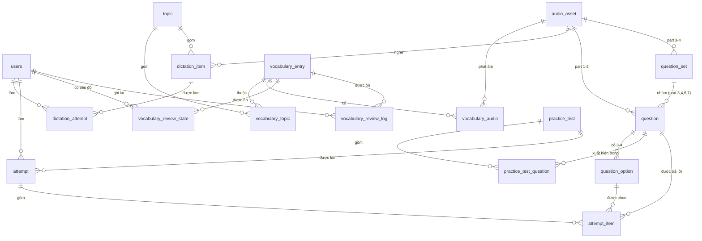

# TOEIC Pilot — Architecture

Last updated: 2026-08-07

## Overview

TOEIC Pilot is a monorepo-scaffolded AI-enabled learning platform. It is organized as a polyglot monorepo containing:

- `apps/api` — FastAPI backend (Python 3.12)
- `apps/web` — Next.js frontend (React, Next App Router)
- `packages/shared` — Shared TypeScript types and API route constants
- `docker` — Dockerfiles and Docker Compose for local/integration environment
- `planning` — product plan and architecture documents

The current repository implements Phase 1 scaffolding: auth, basic user model, web auth pages, and local dev infra. The AI layer and learning modules are placeholders.

## High-level components

**Frontend (apps/web)**

- Next.js 16 App Router usage with Turbopack dev server. Pages implemented for login, register and dashboard.
- Consumes `@toeic-pilot/shared` for request/response types and API route constants.
- Communicates with the API via fetch wrapper (`/apps/web/src/lib/api.ts`).

**Backend (apps/api)**

- FastAPI application exposing:
  - `/health` and `/ready` (health endpoints)
  - `/api/v1/auth/*` (register, login, me)
- SQLAlchemy ORM using DeclarativeBase with engine configured via `settings.database_url`.
- `app/core/database.py` provides `engine`, `SessionLocal`, and `Base`.
- `app/core/config.py` uses `pydantic-settings` to load `.env` and hold runtime config.
- JWT-based auth with `jose` and `passlib` for password hashing.
- Alembic migrations are present under `apps/api/alembic/` (initial migration creates `users` table and `vector` extension).
- API creates tables at startup (`Base.metadata.create_all`) for convenience in dev.

**Persistence & Cache**

- PostgreSQL with `pgvector` extension for vector storage (image in `docker-compose` uses `pgvector/pgvector:pg16`).
- Redis used for cache / ephemeral data; client helper `app/core/redis_client.py`.

**Shared**

- `packages/shared` exposes TypeScript types (TokenResponse, UserPublic, etc.) and `API_ROUTES` used by frontend.

**Infra & Local Dev**

- Docker Compose (`docker/docker-compose.yml`) brings up `postgres`, `redis`, `api`, and `web` services for local development.
- `api` service builds Python image, boots a venv, installs deps via `uv sync`, and runs `uvicorn` with autoreload.
- `web` service builds a Node image, installs PNPM dependencies, and runs Next.js dev server.

## Data flow

1. User interacts with Next.js UI (login/register/dashboard) in the browser.
2. Frontend calls API endpoints defined in `API_ROUTES`.
3. API authenticates users using JWT bearer tokens; `get_current_user` dependency retrieves user by token `sub`.
4. API persists user accounts into Postgres `users` table (UUID PK). Alembic handles schema migrations; during development `create_all` is used for convenience.
5. Redis is available for caching and future session/feature state.

## Security

- Passwords hashed using bcrypt via `passlib`.
- JWTs signed with secret in `settings.secret_key` (defaults to dev secret in `.env` — rotate for production).
- CORS configured to allow origins in `settings.cors_origins` (default allows `http://localhost:3000`).

## Tests & CI

- Small pytest test suite exists under `apps/api/tests` (health test). Running tests inside the container succeeded: `1 passed, 2 warnings`.
- CI is described in README (GitHub Actions) to run API tests with services, lints and frontend checks.

## Data model

Thiết kế đầy đủ + lý do từng quyết định: [`ADR-001-DATA-MODEL.md`](ADR-001-DATA-MODEL.md). Migration `003_domain_schema`. Chưa có endpoint nào chạy trên schema này.

Hình dạng bị chi phối bởi cấu trúc đề TOEIC chứ không bởi một abstraction gọn hơn: **part 3, 4, 6, 7 nhóm nhiều câu dưới một kích thích dùng chung** (`question_set`), còn part 1, 2, 5 thì không; **part 2 có 3 đáp án và không in gì cả**.



## Audio & content pipeline

Quyết định kiến trúc: [`PHASE2-AUDIO.md`](PHASE2-AUDIO.md) Phần A.

Audio được sinh **offline** bằng `edge-tts`, đặt tên content-addressed theo hash của *input* tổng hợp, ghi vào `content/manifest/audio_assets.jsonl` (commit vào repo) rồi nạp vào DB bằng `python -m app.content.seed`. Runtime **không bao giờ** gọi object store: URL phát chỉ là phép ghép chuỗi `{AUDIO_PUBLIC_BASE_URL}/{storage_key}`.

Không có service mới nào trong Compose. `/media` chỉ được mount khi `environment == "development"`; ở nơi khác audio đi thẳng từ CDN. Tuyệt đối không proxy audio qua FastAPI — sẽ mất range request (không tua được) và đốt băng thông của API.

Toàn bộ pipeline nằm sau extra `content` và **không được** lọt vào chuỗi import của `app/main.py`: image production build `--no-dev` nên không có `edge-tts`.

## AI layer (planned)

- Placeholder module: `apps/api/app/ai`.
- Phase 4 will implement:
  - LLM Router (select model and routing logic)
  - Prompt Engine (structured prompts, templates)
  - RAG Engine (vector store, embeddings, retrieval)
  - Memory Service (user-specific memory store)
  - Tool Registry (connectors for actions like grading, analytics)

Considerations for AI layer:

- Store embeddings in Postgres `pgvector` or external vector DB (evaluate scale & cost).
- Securely manage API keys (don't commit to repo; inject at runtime via secrets manager).
- Add rate-limiting and usage quotas for LLM calls.

## Operational concerns

- Development workflow: `pnpm install` then `docker compose up --build` to bring infra up. Web and API run in dev mode (hot reload).
- Migrations: Alembic included; production deployments should run `alembic upgrade head` prior to starting services.
- Observability: add logging, metrics (Prometheus exporter), and error tracking (Sentry) for production.

## Deployment & scaling suggestions

- Containerize production images separately from dev images (no volume mounts, pinned deps, optimized builds).
- Use managed Postgres (or self-hosted cluster) and managed Redis for production.
- Offload embeddings to a managed vector DB (Pinecone/Weaviate/PGVector-hosted) if scale requires it.
- Deploy backend behind an API gateway with TLS, rate limiting, and authentication enforcement.

## File map (important entry points)

- Backend:
  - `apps/api/app/main.py` — FastAPI app and lifecycle
  - `apps/api/app/api/routes/*.py` — route handlers (`auth.py`, `health.py`)
  - `apps/api/app/models/user.py` — User model
  - `apps/api/app/core/*` — config, db, security, redis
  - `apps/api/pyproject.toml`, `apps/api/uv.lock` — python deps
  - `apps/api/alembic/` — migrations

- Frontend:
  - `apps/web/package.json` — scripts and deps
  - `apps/web/src/app/*` — pages (`login`, `register`, `dashboard`)
  - `packages/shared/src/index.ts` — shared types and routes

- Infra:
  - `docker/docker-compose.yml` — compose for local stack
  - `docker/api.Dockerfile`, `docker/web.Dockerfile` — container builds

## Gaps & recommended next work (short-term roadmap)

1. Harden configuration management: add `.env.example` (if missing) and document runtime secrets management.
2. Ensure Alembic migrations are part of startup or CI releases; remove `create_all` from production flow.
3. Implement more comprehensive tests: auth flows, DB integration tests, frontend e2e.
4. Implement basic AI primitives: embedding generation, vector storage, retrieval API skeleton.
5. Add CI steps to run `uv sync`/`uv run pytest` and frontend `pnpm build` in PRs.

## Test & verification performed

- Started Docker Compose stack and confirmed services healthy.
- Ran `pytest` inside the running `api` container: `1 passed, 2 warnings`.

## Appendix — local commands

Start full stack (dev):

```bash
cp .env.example .env
docker compose -f docker/docker-compose.yml up --build
```

API dev (local, non-docker):

```bash
cd apps/api
uv sync --extra dev
uv run uvicorn app.main:app --reload --port 8000
```

Frontend dev:

```bash
cd apps/web
pnpm install
pnpm dev
```

---

Prepared by: automated repository audit (assistant). Review and adjust operational recommendations before production.
