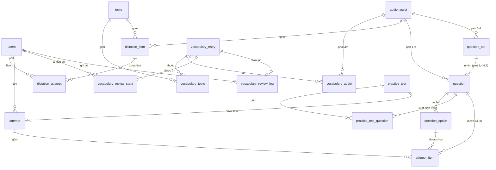

# TOEIC Pilot — Architecture

Last updated: 2026-08-09

> Mô tả **hiện trạng**, không phải kế hoạch. Trạng thái sprint và task nằm ở [`ROADMAP.md`](ROADMAP.md); lý do đằng sau từng quyết định nằm ở các ADR.

## Overview

TOEIC Pilot is a polyglot monorepo containing:

- `apps/api` — FastAPI backend (Python 3.12), managed with `uv`
- `apps/web` — Next.js 16 frontend (React, App Router)
- `packages/shared` — generated TypeScript contract + hand-maintained `API_ROUTES`
- `docker` — Dockerfiles and Docker Compose for local/integration environment
- `planning` — product spec, roadmap, and architecture decision records

**Đã chạy đầu-cuối:** auth + RBAC, đường ống media offline (audio 4 accent, ảnh CC), schema domain 20 bảng, công cụ nhập nội dung cho từ vựng/dictation, và Learning Hub (từ vựng có phát âm, ôn tập SM-2, dictation chấm theo từ).

**Chưa dựng:** TOEIC Practice (schema đã có, chưa có endpoint và chưa có trình nhập câu hỏi) và toàn bộ AI layer (`app/ai` vẫn là package rỗng). Chi tiết ở [`ROADMAP.md`](ROADMAP.md) §5–§7.

## High-level components

**Frontend (apps/web)**

- Next.js 16 App Router với Turbopack dev server.
- Pages: `/` (landing), `/login`, `/register`, `/dashboard`, `/learn` + `/learn/{vocabulary,review,dictation}`, `/admin` + `/admin/{vocabulary,dictation}`, cộng `not-found` và `error` boundary.
- **Design system, không phải styling từng trang.** `src/components/ui.tsx` giữ primitive; màu đến từ CSS variable trong `globals.css` nên sáng/tối là **một** định nghĩa chứ không phải một bản sao `dark:` trên mỗi element. `app-shell.tsx` dựng nav theo vai trò; `audio-button.tsx` phát clip bằng thẻ `Audio` thuần.
- **`src/lib/session.tsx` giải quyết "ai đang đăng nhập" một lần cho cả app.** Trạng thái auth có **ba** giá trị (`loading` / `anonymous` / `authenticated`) vì `localStorage` không tồn tại lúc server render; gộp `loading` vào `anonymous` là thứ từng khiến header mời "Log in" cho người đã đăng nhập.
- Gọi API qua `src/lib/api.ts`, dùng path và type từ `@toeic-pilot/shared` — frontend không bao giờ hardcode đường dẫn hay hình dạng response.

**Backend (apps/api)**

25 endpoint, bốn router:

| Router | Đường dẫn | Nội dung |
|---|---|---|
| `health.py` | `/health`, `/ready` | liveness (không kiểm gì) và readiness (Postgres + Redis) |
| `auth.py` | `/api/v1/auth/*` | register, login, me |
| `learning.py` | `/api/v1/{topics,vocabulary,vocabulary-review,dictation}` | Learning Hub cho học viên — chỉ trả `published` |
| `admin.py` | `/api/v1/admin/*` | parse / commit / CRUD / publish cho `vocabulary`, `dictation`, `topic` |

- **`app/services/` giữ phần logic không phải HTTP** và thuần đủ để test không cần session: `srs.py` (SM-2), `dictation.py` (chuẩn hoá + diff bằng `SequenceMatcher`), `media_state.py` (clip này còn khớp text không?), `content_import.py` (parser dán), `scoring.py` (raw → scaled).
- **`require_role` là dependency, không phải kiểm tra trong thân hàm** — kiểm tra trong thân hàm là thứ người ta quên copy sang route kế tiếp, và hậu quả là một endpoint admin mở cho mọi học viên. Mỗi endpoint admin có test khẳng định `learner` nhận 403.
- SQLAlchemy 2.0 (`Mapped[...]`), session qua dependency `get_db`. **Alembic sở hữu schema**; `metadata.create_all` chỉ chạy khi `environment == "development"`.
- `app/core/config.py` giữ **một** singleton `settings` (`pydantic-settings`), `env_file` dùng đường dẫn tuyệt đối. `ENVIRONMENT=production` từ chối khởi động trên `SECRET_KEY` mặc định.
- `app/core/logging.py` — JSON formatter, text formatter cho đọc local, và `RequestContextMiddleware` gán/nhận `X-Request-ID`, phát qua `ContextVar`, log một dòng mỗi request. Có sẵn từ bây giờ để các lời gọi LLM của Phase 4 truy vết được từ ngày đầu.
- Migrations: `001_initial_users` → `002_audio_assets` → `003_domain_schema` → `004_images_and_scoring` → `005_roles_and_audit` → `006_dictation_audio_optional`.

**Persistence & Cache**

- PostgreSQL với extension `pgvector` (`pgvector/pgvector:pg16`). pgvector đã bật từ migration đầu nhưng **chưa dùng** — để dành cho RAG ở Phase 4.
- Redis là **phụ thuộc mềm** ở mọi nơi: khởi động chỉ log cảnh báo, `/ready` báo `degraded` chứ không fail. Hiện chưa dùng vào việc gì; P1-7 (refresh token + denylist) là việc đầu tiên sẽ dùng tới.

**Shared**

- `packages/shared/src/api-types.ts` và `openapi.json` được **sinh ra**, không viết tay — `pnpm gen:api-types` đọc chính OpenAPI schema của FastAPI. `src/index.ts` chỉ re-export alias thân thiện (`UserPublic`, `TokenResponse`, …) cộng `API_ROUTES` viết tay.
- Job CI `contract` sinh lại và fail nếu file đã commit lệch. `apps/web` import **`dist/`** đã build chứ không phải `src/`, nên `prebuild` xoá sạch `dist` để một bản cũ không che được drift.

**Infra & Local Dev**

- Docker Compose (`docker/docker-compose.yml`) dựng `postgres`, `redis`, `api`, `web`.
- `api` chạy `alembic upgrade head` qua `docker/api-entrypoint.sh` **trước khi** uvicorn bind (`RUN_MIGRATIONS=0` để bỏ qua); `web` chờ `api` báo healthy, và healthcheck của `api` gọi `/ready` — nên không gì khởi động trước khi Postgres thật sự sẵn sàng.
- Source được bind-mount để hot reload; chỉ thay đổi manifest dependency mới cần rebuild.

## Data flow

1. Người dùng thao tác trên UI Next.js.
2. Frontend gọi endpoint qua `apiFetch()` với path lấy từ `API_ROUTES`.
3. API xác thực bằng JWT bearer; `get_current_user` parse `sub` **thành UUID trước** rồi mới truy vấn — so sánh chuỗi tuỳ ý với cột UUID làm Postgres raise và lộ ra thành 500.
4. Endpoint admin đi thêm qua `require_role`; endpoint học viên chỉ đọc nội dung `published`.
5. Dữ liệu nằm ở Postgres. Media **không** đi qua API: URL phát chỉ là phép ghép chuỗi `{AUDIO_PUBLIC_BASE_URL}/{storage_key}`.

## Security

- **Mật khẩu hash bằng thư viện `bcrypt` trực tiếp, không qua `passlib`** (`app/core/security.py`). Giới hạn 72 **byte** của bcrypt được ép tường minh: `PasswordTooLongError` → 422, chứ **không** cắt bớt âm thầm như bản pin cũ — cắt bớt nghĩa là chỉ một tiền tố của mật khẩu từng được dùng để xác thực. Giới hạn tính theo byte chứ không theo ký tự: mật khẩu 40 ký tự tiếng Việt là 120 byte. Hash `$2b$` cũ vẫn verify được; `tests/test_security.py` pin một hash thật làm giá trị vàng.
- JWT ký bằng `settings.secret_key` (`python-jose`). `ENVIRONMENT=production` từ chối boot nếu secret vẫn là giá trị dev.
- Phân quyền theo `users.role` ∈ `learner` / `editor` / `admin`, có CHECK constraint, mặc định `learner`. Publish chỉ dành cho `admin`.
- CORS theo `settings.cors_origins` (mặc định cho `http://localhost:3000`).
- **Còn thiếu:** rate limiting (P1-8) và token vẫn ở `localStorage` (P1-7). Cả hai là điều kiện tiên quyết cứng của AI layer — một endpoint LLM không đo đếm là một hoá đơn không giới hạn.

## Content workflow & RBAC

Vòng đời nội dung đã khép kín cho từ vựng và dictation ([`ADR-005-CONTENT-TOOLING.md`](ADR-005-CONTENT-TOOLING.md)):

```
admin dán text ──► POST /admin/{loại}/parse   (KHÔNG BAO GIỜ ghi database)
                        │ trả về cấu trúc đã parse + lỗi từng dòng
                        ↓
                   POST /admin/{loại}         (luôn ghi ở status='draft')
                        ↓
        uv run python -m app.content.backfill_audio   (ngoài luồng)
                        ↓
              POST /admin/{loại}/{id}/publish  (chỉ admin; CHẶN nếu audio thiếu/lệch)
                        ↓
                   học viên thấy nội dung
```

Ba bất biến ở đây, tất cả đều fail âm thầm nếu bị phá:

- **Parse và commit là hai endpoint tách rời**, và parse không ghi gì cả. Xem trước rồi mới quyết định là toàn bộ lý do công cụ này tồn tại.
- **Commit luôn ra `draft`** — không có đường tắt sang `published`.
- **API không sinh được audio.** Nó thậm chí không import nổi pipeline TTS (`PHASE2-AUDIO` §A4.1), và tổng hợp đồng bộ sẽ kéo theo một job queue mà §A2.5 cố ý tránh. `backfill_audio` chạy ngoài luồng và hàng đợi của nó là một **câu truy vấn** — "nội dung nào thiếu audio hoặc audio không còn khớp text" — nên không có bảng hàng đợi, không có trạng thái retry, và chạy lại chỉ đơn giản là tìm thấy ít việc hơn.

Audit trail đi kèm qua `PublishableMixin` (`created_by`, `published_by`, `published_at`) trên mọi bảng nội dung: bổ sung sau thì nội dung cũ vĩnh viễn không truy nguyên được.

## Data model

Thiết kế đầy đủ + lý do từng quyết định: [`ADR-001-DATA-MODEL.md`](ADR-001-DATA-MODEL.md). **20 bảng**, tạo bởi migration `003`–`006`.

Phần từ vựng và dictation **đã có endpoint chạy trên nó**. Phần question / attempt / practice test thì chưa — schema có, endpoint không (Sprint 5). Bốn bảng của Phase 4–5 (`study_plan`, `learning_memory`, `knowledge_chunk`, `ai_interaction`) mới chỉ tồn tại trên giấy, vì chiều `vector(n)` phụ thuộc vào embedding model mà ADR-003 chưa chọn — và đổi model nghĩa là tính lại toàn bộ corpus.

`app/models/validators.py` giữ các luật nội dung mà không ràng buộc khai báo nào diễn đạt được (ADR-001 §B4): ít nhất một đáp án đúng, số phương án theo từng part, `question.part` khớp part của set, và luật in ấn. Partial unique index chỉ loại được trường hợp có **nhiều hơn** một đáp án đúng — câu không có đáp án đúng nào vẫn insert sạch và không bao giờ trả lời đúng được.

Hình dạng bị chi phối bởi cấu trúc đề TOEIC chứ không bởi một abstraction gọn hơn: **part 3, 4, 6, 7 nhóm nhiều câu dưới một kích thích dùng chung** (`question_set`), còn part 1, 2, 5 thì không; **part 2 có 3 đáp án và không in gì cả**.



## Audio & content pipeline

Quyết định kiến trúc: [`PHASE2-AUDIO.md`](PHASE2-AUDIO.md) Phần A.

Audio được sinh **offline** bằng `edge-tts`, đặt tên content-addressed theo hash của *input* tổng hợp, ghi vào `content/manifest/audio_assets.jsonl` (commit vào repo) rồi nạp vào DB bằng `uv run python -m app.content.seed`. Runtime **không bao giờ** gọi object store: URL phát chỉ là phép ghép chuỗi `{AUDIO_PUBLIC_BASE_URL}/{storage_key}`.

Không có service mới nào trong Compose. `/media` chỉ được mount khi `environment == "development"`; ở nơi khác audio đi thẳng từ CDN. Tuyệt đối không proxy audio qua FastAPI — sẽ mất range request (không tua được) và đốt băng thông của API.

Toàn bộ pipeline nằm sau extra `content` và **không được** lọt vào chuỗi import của `app/main.py`: image production build `--no-dev` nên không có `edge-tts`.

Đường ống **ảnh** ([`ADR-004-IMAGES.md`](ADR-004-IMAGES.md)) có cấu trúc giống hệt nhưng đầu vào khác: `app/content/images.py` tải từ một file spec **do người chọn tay** chứ không phải từ search API, vì một tấm ảnh vẫn cần người quyết định xem có viết được bốn câu mô tả về nó hay không. `image_asset` là bảng **riêng** chứ không gộp vào `audio_asset`: gộp lại thì quá nửa số cột luôn NULL. `license`, `attribution`, `source_url` đều NOT NULL vì phần lớn ảnh mở là CC-BY — dùng được **kèm** ghi công — và lưu ghi công thôi chưa đủ: endpoint nào phục vụ ảnh Part 1 cũng phải trả nó ra và UI phải render.

Hiện trạng vận hành đầy đủ của cả hai đường ống, kèm danh sách điểm yếu thành thật, ở [`MEDIA-PIPELINE.md`](MEDIA-PIPELINE.md) — đọc §10 trước khi mở rộng bên nào.

## AI layer (chưa dựng)

- `apps/api/app/ai` hiện là package **rỗng** — chỉ có `__init__.py`. Không có dòng code AI nào trong repo.
- **Chặn bởi ADR-003**, chưa viết: chưa chọn LLM provider, chưa chốt embedding model, chưa có ngân sách token.
- Phase 4 will implement:
  - LLM Router (select model and routing logic)
  - Prompt Engine (structured prompts, templates)
  - RAG Engine (vector store, embeddings, retrieval)
  - Memory Service (user-specific memory store)
  - Tool Registry (connectors for actions like grading, analytics)

Considerations for AI layer:

- Store embeddings in Postgres `pgvector` or external vector DB (evaluate scale & cost).
- Securely manage API keys (don't commit to repo; inject at runtime via secrets manager).
- Add rate-limiting and usage quotas for LLM calls.

## Operational concerns

- Development workflow: `pnpm install` rồi `docker compose up --build`. Web và API chạy dev mode (hot reload). **Lưu ý:** container `api` dev chạy `create_all` sau mỗi lần reload, nên `docker compose stop api` trước khi làm việc với migration.
- Migrations: `docker/api-entrypoint.sh` chạy `alembic upgrade head` **trước khi** uvicorn bind. Đã tự động, không phải khuyến nghị.
- Observability: structured logging + `X-Request-ID` **đã có** (`app/core/logging.py`). Còn thiếu: metrics (Prometheus) và error tracking (Sentry).

## Deployment & scaling suggestions

- Containerize production images separately from dev images (no volume mounts, pinned deps, optimized builds).
- Use managed Postgres (or self-hosted cluster) and managed Redis for production.
- Offload embeddings to a managed vector DB (Pinecone/Weaviate/PGVector-hosted) if scale requires it.
- Deploy backend behind an API gateway with TLS, rate limiting, and authentication enforcement.

## File map (important entry points)

Backend (`apps/api/`):

| Đường dẫn | Vai trò |
|---|---|
| `app/main.py` | FastAPI app + lifecycle. **Không gì reachable từ đây được import `app.content`** |
| `app/api/routes/` | `health.py`, `auth.py`, `learning.py`, `admin.py` |
| `app/api/deps.py` | `get_db`, `get_current_user`, `require_role` |
| `app/schemas/` | Pydantic I/O: `auth.py`, `learning.py`, `admin.py` — nguồn của contract sinh ra |
| `app/services/` | `srs.py`, `dictation.py`, `media_state.py`, `content_import.py`, `scoring.py` |
| `app/models/` | 20 bảng; `mixins.py` giữ từ vựng cột dùng chung, `validators.py` giữ luật nội dung. **Model mới phải re-export từ `__init__.py`** |
| `app/core/` | `config.py`, `database.py`, `security.py`, `logging.py`, `redis_client.py`, `media.py` |
| `app/content/` | Pipeline offline sau extra `content`: `generate`, `images`, `seed`, `seed_scores`, `backfill_audio`, `tts`, `storage`, `manifest`, `settings` |
| `app/ai/` | Rỗng — chờ ADR-003 |
| `alembic/` | Migration `001`–`006`. **Không được lint và không được type-check** |
| `content/manifest/` | `audio_assets.jsonl`, `image_assets.jsonl` — commit vào repo |
| `media/` | File mp3/jpg — **gitignore** |

Frontend (`apps/web/src/`):

| Đường dẫn | Vai trò |
|---|---|
| `app/` | Route: `login`, `register`, `dashboard`, `learn/**`, `admin/**`, `not-found`, `error` |
| `app/globals.css` | Token màu — sáng/tối là **một** định nghĩa |
| `components/ui.tsx` | Primitive của design system |
| `components/app-shell.tsx` | Nav theo vai trò |
| `components/audio-button.tsx`, `admin-bits.tsx` | Phát audio; lưới review + badge trạng thái audio |
| `lib/api.ts`, `lib/session.tsx`, `lib/auth-storage.ts` | Fetch wrapper, phiên đăng nhập, lưu token |

Shared & infra:

| Đường dẫn | Vai trò |
|---|---|
| `packages/shared/src/api-types.ts`, `openapi.json` | **Sinh ra — không sửa tay** |
| `packages/shared/src/index.ts` | Alias + `API_ROUTES` (viết tay) |
| `scripts/generate-api-types.sh` | Chạy cả hai toolchain |
| `docker/docker-compose.yml`, `api.Dockerfile`, `web.Dockerfile`, `api-entrypoint.sh` | Stack local |
| `.github/workflows/ci.yml` | 4 job: `api`, `web`, `contract`, `docker` |

## Khoảng trống đã biết

Danh sách task đầy đủ ở [`ROADMAP.md`](ROADMAP.md) §6–§8 và §10. Những khoảng trống mang tính **kiến trúc**:

1. **Không có rate limiting** (P1-8). Điều kiện tiên quyết cứng của endpoint LLM đầu tiên.
2. **Token nằm ở `localStorage`** (P1-7). Cần chuyển sang httpOnly cookie + refresh token + denylist trên Redis — cũng là việc đầu tiên Redis thật sự được dùng tới.
3. **0% coverage phía frontend** (P1-3). Không có test component, không có e2e.
4. **Branch protection chưa bật.** 13 gate CI xanh mà không ai bắt buộc thì chỉ là gợi ý.
5. **Chưa chốt embedding model** ⇒ bốn bảng của Phase 4–5 chưa tạo được. `vector(n)` là quyết định một chiều.
6. **Không có gì kiểm chứng media còn phục vụ được.** `/ready` kiểm Postgres và ping Redis, không kiểm media — cấu hình sai `AUDIO_PUBLIC_BASE_URL` ở production nghĩa là mọi media 404 trong khi container vẫn báo healthy (`MEDIA-PIPELINE.md` §10.8).
7. **Nội dung, không phải tính năng, là nút thắt.** 3 từ vựng và 4 câu dictation — đủ chứng minh đường đi, không đủ dạy ai.

## Kiểm chứng lần cuối (2026-08-09)

| | |
|---|---|
| `uv run pytest` | **269 passed, 2 deselected** (2 test `external` gọi edge-tts thật) |
| `uv run ruff check app tests` | sạch |
| `uv run ruff format --check` | 66 file đã đúng định dạng |
| `uv run mypy` | strict, 46 file, không lỗi |
| `pnpm --filter @toeic-pilot/web lint` | sạch |
| `pnpm gen:api-types` | sinh lại cho ra file y hệt — contract không drift |
| Endpoint trong `openapi.json` | 25 |
| Media | 38 clip audio, 3 ảnh |

## Appendix — local commands

Start full stack (dev):

```bash
cp .env.example .env
docker compose -f docker/docker-compose.yml up --build
```

API dev (local, non-docker):

```bash
cd apps/api
uv sync --extra dev
uv run uvicorn app.main:app --reload --port 8000
```

Frontend dev:

```bash
cd apps/web
pnpm install
pnpm dev
```

Pipeline nội dung offline (cần `--extra content`, **không bao giờ** chạy lúc request):

```bash
cd apps/api
uv sync --extra dev --extra content
uv run python -m app.content.generate --input content/sources/<spec>.jsonl
uv run python -m app.content.images   --input content/sources/images/<spec>.jsonl
uv run python -m app.content.seed          # manifest -> audio_asset / image_asset
uv run python -m app.content.backfill_audio [--dry-run]
```
