# Pipeline sinh đề TOEIC 200 câu

> **LƯU TRỮ.** Tệp này được ghim theo commit nó được viết và **không cập nhật**.
> Giữ lại vì lý do đằng sau vẫn đọc được, không phải vì nội dung còn đúng.
> Trạng thái thật: `planning/docs/ROADMAP.md`. Hành vi hiện tại: xem chỉ mục ở `CLAUDE.md`.

> Thay bằng `EXAM-GENERATION-RUNBOOK.md` — cùng các chặng, mới hơn, có cả bước lên production.

**Trạng thái:** ✅ ĐÃ CHẠY HẾT ĐƯỜNG · cập nhật 2026-08-24
**Nguồn:** `app/content/generate_exam.py` + `app/content/exam/*.py`
**Đối chiếu:** đề `tp-form-06` — 200 câu, 54 clip audio (`source=tts`), 6 ảnh Part 1 (`license=generated`), 16 hình ngữ liệu vẽ từ dữ liệu.

> Tài liệu này mô tả **hiện trạng**, không phải kế hoạch. Lý do đằng sau từng quyết định ban đầu nằm ở [`generate-full-toeic.md`](generate-full-toeic.md); chỗ nào bản chạy thật khác kế hoạch thì ở đây ghi theo bản chạy thật và nói ra chỗ khác.

Chạy **ngoài luồng**, trong image worker. `app.content` không bao giờ được import từ `app/main.py`, và ảnh production build không có extra `content`.

---

## Hai luật xuyên suốt

Mọi mũi tên trong sơ đồ đều phục tùng hai luật này. Bỏ một trong hai thì phần lớn thiết kế còn lại không còn lý do tồn tại.

**1. Hàng đợi là một truy vấn trên thư mục.** Không bảng job, không cột `status`, không trạng thái retry. *"Ô nào chưa có tệp dán"* là câu hỏi, và **xoá** một tệp chính là đưa ô đó trở lại hàng đợi. Một cột `status` bên cạnh sẽ là nguồn sự thật thứ hai phải giữ đồng bộ với sự tồn tại của tệp — và hai nguồn cho cùng một câu hỏi là chỗ chúng lệch nhau. Cùng luật với `backfill_audio` và `enrich_skills`.

**2. Mỗi chặng đọc và ghi tệp** dưới `content/generated/<slug>/`. Chạy lại chặng sau không phải trả tiền lại cho chặng trước. Một lượt sinh cả đề tốn hàng chục phút và **sẽ** đứt — hết quota, mất mạng, máy ngủ.

---

## Sơ đồ

```mermaid
flowchart TD

  cli(["uv run python -m app.content.generate_exam"]) --> cmdPlan

subgraph PLAN["1 · Kế hoạch"]
  direction TB
  cmdPlan["plan --part N --seed"]
  bpFile[/"blueprint.json<br/>nhãn · ngữ pháp · bối cảnh · giọng<br/>số người trong ảnh · brief hình · số đoạn"/]
  cmdPlan --> bpFile
end

subgraph WRITE["2 · Sinh chữ"]
  direction TB
  qWrite{"Ô nào chưa có<br/>tệp dán?"}
  cmdWrite["write --limit --max-tokens"]
  gw(["Gateway LLM · tier cheap|strong"])
  quota{"Hết hạn mức ngày?"}
  stop["Dừng hẳn · mã thoát 3<br/>ô đã ghi vẫn còn trên đĩa"]
  paste[/"paste/&lt;ô&gt;.txt<br/>[SCRIPT] [PASSAGE] [QUESTION]"/]
  photoTxt[/"photos/&lt;ô&gt;.txt<br/>mô tả ảnh Part 1"/]
  graphTxt[/"graphics/&lt;ô&gt;[-N].txt<br/>dữ liệu bảng"/]

  qWrite --> cmdWrite --> gw --> quota
  quota -- "có" --> stop
  quota -- "không" --> paste
  cmdWrite --> photoTxt
  cmdWrite --> graphTxt
end

subgraph BALANCE["3 · Cân vị trí đáp án"]
  direction TB
  cmdBalance["balance --part"]
end

subgraph CHECK["4 · Cổng kiểm"]
  direction TB
  cmdCheck["check --part --verify"]
  shape["cú pháp · số phương án theo part<br/>Source · tên người nói<br/>hình khớp câu · dạng riêng Part 7"]
  judge(["--verify · LLM đối chiếu đáp án<br/>và đếm phương án điền được"])
  spread["check_answer_spread<br/>phân bố A/B/C/D trên CẢ đề"]
  verdict{"Kết quả"}
  blocked["✗ chặn nạp · mã thoát 1"]
  flagged["⚠ cần người nhìn · mã thoát 0"]

  cmdCheck --> shape --> verdict
  cmdCheck --> judge --> verdict
  cmdCheck --> spread --> verdict
  verdict --> blocked
  verdict --> flagged
end

subgraph PRUNE["5 · Loại"]
  direction TB
  cmdPrune["prune --part --dry-run --ambiguity"]
  meter{"≥70% câu nhận cùng<br/>một câu trả lời?"}
  skipAmb["bỏ phép kiểm mơ hồ<br/>đổi model mạnh hơn"]
  del["xoá paste/&lt;ô&gt;.txt<br/>+ photos/ và graphics/ đi kèm"]

  cmdPrune --> meter
  meter -- "có · phản xạ" --> skipAmb
  meter -- "không" --> del
end

subgraph IMG["6 · Ảnh"]
  direction TB
  cmdPhoto["photo --seed --aspect --no-greyscale"]
  flux(["image_gen ngoài repo · FLUX.2-klein-4B<br/>tiến trình con, virtualenv riêng"])
  grey["to_greyscale"]
  pngPhoto[/"images/&lt;ô&gt;.png + .prompt.txt"/]
  eye{{"NGƯỜI XEM TỪNG TẤM"}}

  cmdGraphic["graphic"]
  pil(["vẽ bằng PIL từ dữ liệu bảng<br/>KHÔNG gọi mô hình ảnh"])
  pngGraph[/"graphic-images/partN/&lt;ô&gt;[-sK].png<br/>+ .alt.txt"/]

  cmdPhoto --> flux --> grey --> pngPhoto --> eye
  cmdGraphic --> pil --> pngGraph
end

subgraph LOAD["7 · Nạp vào database"]
  direction TB
  cmdLoad["load --part --slot --token --api"]
  ensure["ensure_test · slug · title · kind"]
  parse(["POST /parts/&lt;n&gt;/parse"])
  commit(["POST /parts"])
  db[("question · question_option · question_set<br/>practice_test_question<br/>tất cả ở trạng thái draft")]

  cmdLoad --> ensure --> parse --> commit --> db
end

subgraph MEDIA["8 · Media"]
  direction TB
  script[/"question.audio_script<br/>question_set.audio_script"/]
  bell(["POST /admin/media/audio/requests → 202<br/>chuông cửa Redis, không phải hàng đợi"])
  worker(["tts_worker · image riêng có ffmpeg<br/>doorbell + quét lại mỗi 300s"])
  qAudio{"Thiếu audio, hoặc<br/>audio không khớp script?"}
  asset[("audio_asset · source=tts")]
  pushA["push_media → S3"]

  impImg["import_media image --part 1|3|4|7<br/>--match index|passage"]
  cloud(["Cloudinary"])
  imgAsset[("image_asset · license=generated<br/>gắn vào câu hoặc ô ngữ liệu")]

  verify["media --push<br/>hỏi NHÀ CUNG CẤP, không hỏi database"]

  script --> bell --> worker --> qAudio --> asset --> pushA --> verify
  impImg --> cloud --> imgAsset --> verify
end

subgraph REVIEW["9 · Người duyệt"]
  direction TB
  human{{"/admin/tests/&lt;slug&gt;<br/>nghe từng clip · nhìn từng ảnh<br/>đọc từng câu bị cờ"}}
  gate{"Cổng publish"}
  pub["published"]
  back["về draft để sửa"]

  human --> gate
  gate -- "đạt" --> pub
  gate -- "chưa đạt" --> back
  back --> human
end

  bpFile --> qWrite
  paste --> cmdBalance
  cmdBalance --> cmdCheck
  blocked --> cmdPrune
  del -- "ô trở lại hàng đợi" --> qWrite
  photoTxt --> cmdPhoto
  graphTxt --> cmdGraphic
  flagged --> cmdLoad
  eye --> impImg
  pngGraph --> impImg
  db --> script
  verify --> human

classDef cmd stroke-width:3px
classDef gateShape stroke-width:3px,stroke-dasharray:6 3
class cmdPlan,cmdWrite,cmdBalance,cmdCheck,cmdPrune,cmdPhoto,cmdGraphic,cmdLoad,impImg,pushA,verify cmd
class eye,human gateShape
```



---

## 1 · Kế hoạch — `plan --part N --seed`

Quyết định đề sẽ là gì **trước khi** gọi mô hình, và ghi ra `blueprint.json`.

Mô hình viết câu hỏi giỏi hơn nhiều so với thiết kế đề. Bảo nó *"sinh 30 câu Part 5"* thì phần lớn rơi vào vài điểm ngữ pháp dễ nhất, vì đó là vùng xác suất cao nhất — và **không có gì trong đầu ra nói cho ta biết điều đó đã xảy ra**. Phân bố điểm ngữ pháp là quyết định của người ra đề, nên nó được ghi thành dữ liệu và mô hình chỉ việc viết đúng ô đã giao.

Hệ quả thứ hai, quan trọng không kém: **nhãn được quyết định trước, không gắn sau.** `enrich_skills.py` đọc câu rồi đoán nhãn; với đề tự sinh thì đảo lại — blueprint giao nhãn, và `enrich_skills` trở thành **bước đối chiếu**: nó đoán khác thứ đã giao nghĩa là câu viết chưa đúng dạng, chứ không phải nhãn sai.

Một ô mang sẵn: nhãn dạng câu, điểm ngữ pháp, bối cảnh, giọng đọc, số người trong ảnh (Part 1), brief hình (Part 3/4), số đoạn ngữ liệu (Part 7).

## 2 · Sinh chữ — `write --limit --max-tokens`

Hàng đợi là *"ô nào chưa có tệp dán"*. Mỗi ô là một lượt gọi mô hình và ghi ra `paste/<ô>.txt`.

**Hạn mức ngày thì dừng hẳn, không backoff.** Hạn mức ngày không tự hết sau ba mươi giây, nên backoff sẽ cày hết mọi ô còn lại, hỏng y hệt nhau, và chôn mất dòng nói đúng nguyên nhân. Mã thoát 3; ô đã ghi vẫn còn trên đĩa.

**Mô tả ảnh và dữ liệu bảng đi ra hiện vật riêng** (`photos/`, `graphics/`): parser từ chối dòng lạ sau các đáp án, nên nhét chúng vào tệp dán là làm cả khối không đọc được.

## 3 · Cân vị trí đáp án — `balance --part`

**Lỗi ở tầm đề, không câu nào sai.** Đo thật: một model đặt **29/30** đáp án vào (A). Không phép kiểm từng câu nào thấy được điều đó — mỗi câu đều hợp lệ. Chặng này hoán vị hai phương án **và** dòng `Answer`, rồi ghi đè chính tệp dán.

## 4 · Cổng kiểm — `check --part --verify`

Ba nhánh chạy song song: kiểm hình dạng (cú pháp, số phương án theo part, `Source` bắt buộc, tên người nói, hình khớp câu hỏi, dạng riêng của Part 7), đối chiếu đáp án bằng LLM (`--verify`), và `check_answer_spread` nhìn phân bố A/B/C/D trên **cả đề**.

**Cờ không làm lệnh thất bại.** Chúng là chỗ người cần nhìn, không phải lỗi. Trộn hai loại lại thì người chạy học cách bỏ qua mã thoát, và lúc đó cả hai loại cùng mất tác dụng.

**Người chấm luôn được xem ngữ cảnh của câu**: hội thoại Part 3, câu hỏi Part 2 (nằm trong script chứ không phải `prompt_text`), đoạn văn Part 6, bảng dữ liệu của câu hỏi hình. Bốn lần thiếu ngữ cảnh đã cho ra 26/39 rồi 15/25 cờ giả — mỗi lần đều trông như đề viết tệ.

## 5 · Loại — `prune --part --dry-run --ambiguity`

**Xoá chứ không đánh dấu**, và đó là cả ý tưởng: hàng đợi của chặng sinh là một truy vấn trên thư mục, nên xoá một tệp chính là đưa ô đó trở lại hàng đợi. Mô tả ảnh và dữ liệu bảng đi cùng ô cũng bị xoá — để lại thì một ô đã bị loại vẫn còn hiện vật của lần viết hỏng.

**Đo người chấm trước khi tin nó.** Với gemma3 4B, phép kiểm mơ hồ trả về đúng chuỗi `"AB"` cho mọi câu, kể cả câu sai rõ ràng. Cứ thế mà loại thì ta xoá những câu **đạt** dựa trên một phép đo không đo gì cả — và lần chạy sau xoá tiếp, vì câu sinh lại cũng nhận cùng câu trả lời phản xạ ấy. Dấu hiệu: ≥70% câu nhận cùng một câu trả lời.

## 6 · Ảnh — `photo` và `graphic`

Hai đường khác hẳn nhau, và đừng gộp.

**Ảnh Part 1 do mô hình sinh, và phải có người xem trước khi gắn.** Model vẽ thừa một người là chuyện đã xảy ra thật, mà bốn câu mô tả đã viết theo giả định chỉ có hai. Không có đường tắt nào thay được con mắt ở đây. Bộ sinh ảnh nằm ngoài repo, gọi qua tiến trình con vì nó chạy trong virtualenv riêng.

**Hình ngữ liệu Part 3/4/7 vẽ từ dữ liệu bằng PIL, không gọi mô hình ảnh.** Giá trị của hình này nằm ở **chữ đọc được**, thứ mô hình khuếch tán không vẽ đáng tin. Vẽ từ dữ liệu cũng là thứ duy nhất khiến chữ thay ảnh sinh ra tự động — và `assign_passage_image` **từ chối (409)** một hình ngữ liệu không có chữ thay ảnh.

Tên tệp mang **số ô ngữ liệu** (`p7-15-s2.png`) chứ không chỉ số thứ tự: một cụm Part 7 có thể có hai hình gắn vào hai ô khác nhau.

## 7 · Nạp vào database — `load --part --slot --token --api`

Đi qua **đúng đường mà người dán đi**: `POST /parts/<n>/parse` → xem kết quả → `POST /parts`, với token của một tài khoản `editor`.

Đắt hơn một lệnh `INSERT` và vẫn chọn, vì đường HTTP là đường **đã có test** và có mọi luật ở `validators.py` đứng sau. Gọi thẳng service thì bỏ qua tầng schema, và chỗ đầu tiên nó lộ ra sẽ là một câu Part 2 có bốn đáp án nằm im trong database — hợp lệ với mọi thứ trừ chính bài thi.

**`--part` không phải tiện nghi:** `commit_part` **cộng thêm** câu chứ không thay thế, nên nạp lại cả blueprint để thêm Part 1 sẽ dán Part 5 vào đề lần thứ hai.

Đề nạp xong nằm ở trạng thái `draft`.

## 8 · Media

**Audio không do pipeline sinh — và đây là chỗ bản chạy thật khác kế hoạch.** `generate-full-toeic.md` §7 mô tả một chặng sinh tệp spec cho `app.content.generate`. Thực tế: chữ vào database mang theo `audio_script`, rồi `tts_worker` nhặt việc bằng đúng câu hỏi kiểu hàng-đợi-là-truy-vấn — *"nội dung nào thiếu audio, hoặc audio không còn khớp script"*. Kiểm bằng dữ liệu: cả 54 clip của `tp-form-06` đều là `source=tts`.

**Nút bấm chỉ rung chuông cửa.** `POST /admin/media/audio/requests` trả **202** và không ghi vào bảng nào — API không thể sinh audio (A4.1). Một tin nhắn mất lúc worker chết cũng không sao, vì lượt quét 300 giây tìm đúng việc đó.

**Ảnh nhập bằng `import_media`**, khớp theo **số** trong tên tệp, và nó **từ chối làm nửa việc**: thừa tệp hoặc thiếu khe thì dừng cả lượt. Một lần nhập nửa vời để lại vài câu thiếu media, và chỗ hổng chỉ lộ ra khi có người học chạm đúng câu đó.

**`media --push` hỏi nhà cung cấp, không hỏi database.** Có một lỗ hoàn toàn im lặng: worker ghi clip xuống đĩa **local** trong khi `audio_public_base_url` trỏ tới Supabase. Hàng `audio_asset` đủ, `validate_question` trả OK, giao diện hiện nút play, và **không có gì phát ra**. Không truy vấn nào trong database thấy được, vì database đúng — thứ sai nằm ở nơi database không nhìn tới.

## 9 · Người duyệt

Không có bước nào thay được bước này, và pipeline không giả vờ ngược lại.

Người duyệt xem trong `/admin/tests/<slug>`: nghe từng clip, nhìn từng ảnh, đọc từng câu bị cờ ở chặng 4, sửa những chỗ cần. Ước lượng thật thà: **2–4 giờ cho 200 câu** — con số đáng so với việc tự viết 200 câu (hàng tuần), không phải với số không.

Cổng publish tự chặn phần còn lại: thiếu audio, thiếu ảnh, hoặc kịch bản đã đổi sau khi thu — so **vân tay** của script, không so hai mốc thời gian.

---

## Chạy lại được

Không có bảng job, không có trạng thái retry. Chạy lại một lệnh là **tìm thấy ít việc hơn**, và đó là toàn bộ cơ chế phục hồi:

| Chặng | Bỏ qua cái gì |
|---|---|
| `write` | ô đã có tệp dán |
| `photo` | ô đã có tệp PNG |
| `graphic` | vẽ lại được vô hại — cùng dữ liệu cho cùng hình |
| `load` | idempotent theo `slug` + số câu chuẩn |
| `tts_worker` | clip đã có và vẫn khớp script |

Muốn sinh lại một ô thì **xoá tệp của nó** — `prune` chính là việc đó, làm hàng loạt theo kết quả kiểm.

## Thứ tự lệnh

```bash
cd apps/api
uv run python -m app.content.generate_exam plan    --slug tp-form-07 --part 5
uv run python -m app.content.generate_exam write   --slug tp-form-07 --limit 3
uv run python -m app.content.generate_exam balance --slug tp-form-07 --part 5
uv run python -m app.content.generate_exam check   --slug tp-form-07 --part 5 --verify
uv run python -m app.content.generate_exam prune   --slug tp-form-07 --part 5 --dry-run
uv run python -m app.content.generate_exam photo   --slug tp-form-07          # Part 1
uv run python -m app.content.generate_exam graphic --slug tp-form-07          # Part 3/4/7
uv run python -m app.content.generate_exam load    --slug tp-form-07 --part 5 --token <editor>
uv run python -m app.content.import_media image --test tp-form-07 --part 1 --dir ... --dry-run
uv run python -m app.content.generate_exam media   --slug tp-form-07 --push
```

Chạy `--dry-run` trước ở mọi lệnh có nó. `prune` xoá tệp, `import_media` gắn media vào câu — cả hai đều không lùi được bằng một lệnh.
